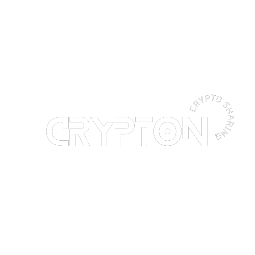

# 
It is a Crypto app, which is based on web 3.0, build using javascript and solidity , with UI based on react js, and blockchain contracts deployed using smart contract, based on hardhat and ethereum. Currently it uses ropsten test network for testing, as it is locally hosted

