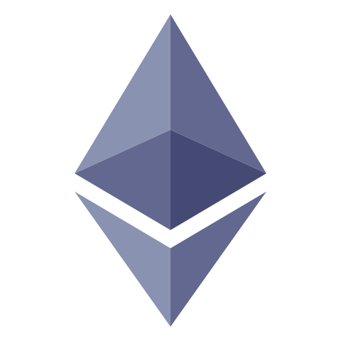
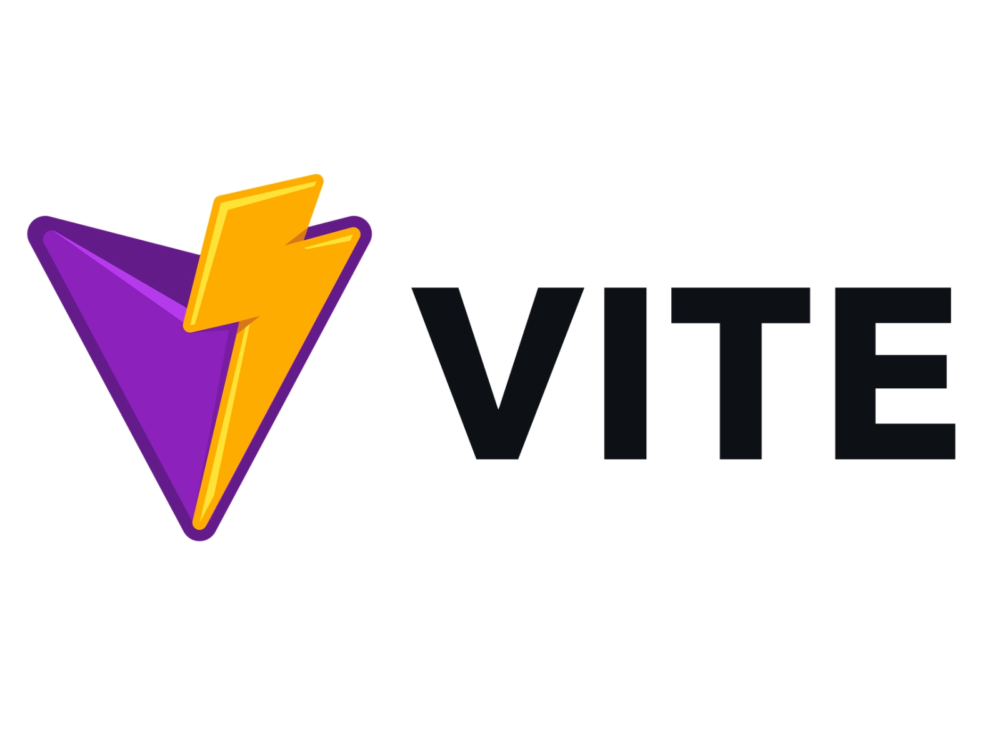
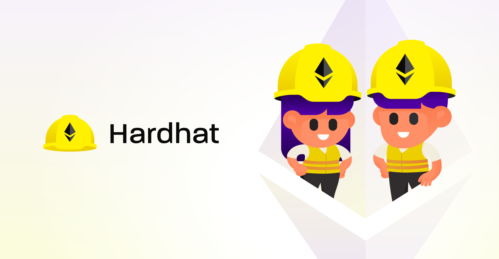

# 
It is a Cryptocurrency Transaction Web-app, which is based on web 3.0, build using javascript and solidity , with UI based on react js and Tailwind, and blockchain contracts deployed using smart contract, based on hardhat and ethereum. 
##  ETHEREUM SMART CONTRACTS BASED
### Technology used:
     
- [x] <strong><samp>Currently uses Ropsten Network Test Eth as hosted locally, modify it if you want to use it in mainstream </samp> </strong>
- [x] <strong><samp>Node modules are not uploaded due to size, install node and dependencies according to your use</samp> </strong>
